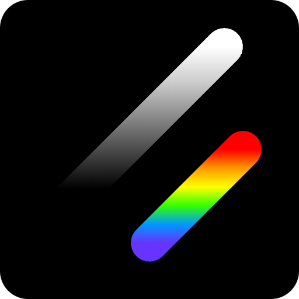
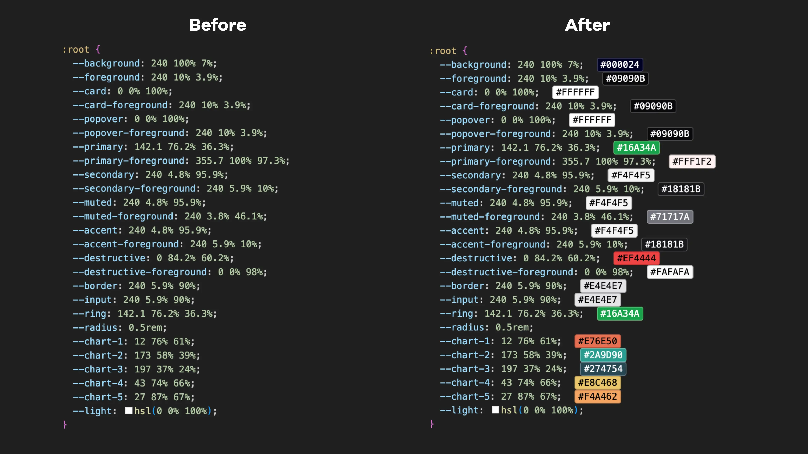

# shadcn/colors

    

shadcn/colors is a Visual Studio Code extension displays real-time previews of colors for themes in https://ui.shadcn.com

Disclaimer: This extension is not directly affiliated with or endorsed by the creator of shadcn. It is an independent solution designed to address specific issues and is not associated with shadcn in any way.

**Change Colors for HSL values**

- Select the `hsl` value e.g. `120 40% 70%` within your `.css` file
- Type `cmd + shift + p` or `ctrl + shift + p`
- Type `shadcn/colors: Change HSL Color` and type the `hex` value there
- That's it you should see your latest `hsl` converted from `hex` you provided

## Note

- If the color picker isn’t showing, double-check your HSL syntax
- Large files with lots of colors might slow things down a bit

---

Happy Coding!
